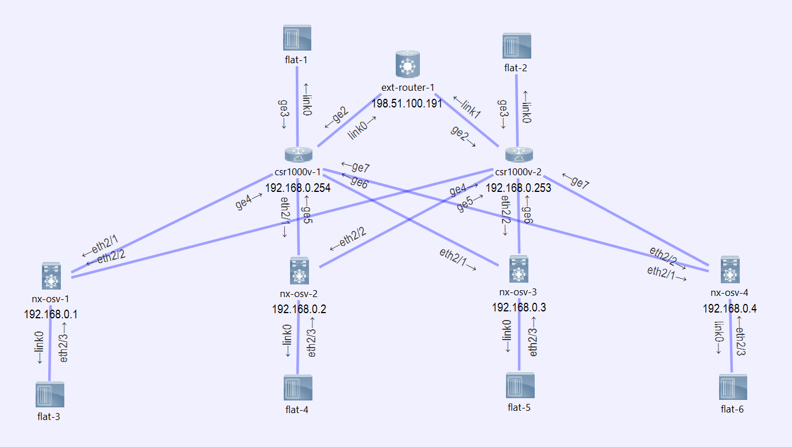

# Network Automation Workshop - Topology

This repository contains sources for excercises generated during the
[Building Network Automation Solutions](http://automation.ipspace.net/Main_Page) Online Course.

## Installation

I'm running Ansible in a Ubuntu box. 

The networking examples are focused on Cisco IOS and Nexus OS. I run them in VIRL with a set up topology as described in here. They are built for this particular setup consisting of two csr1000v Routers and two nx-osv switches running on VIRL.

## Topology of networking devices

The Topology represents a small data center setup of a layer-3 spine and leave fabric. There are two types of devices used to illustrate differences between two OS types, ios and nxos. There are two spines in it, built on Cisco csr1000v, named r1 (csr1000v-1 in the picture) and r2 (csr1000v-2). Attachted to them there are four leaves, built with nx-osv devices, named s1 to s4 (nx-osv-1 to nx-osv-4 in the picture). Each leave is connected to both spines. The spines are not directly connected to each other but they have both an uplink to the service provider's edge router named ext-router-1.

This is the list of object names, host names and loopback ip addresses used in the initial setup:

object | hostname | loopback ip
-------|----------|------------
csr1000v-1 | r1 | 192.168.0.254
csr1000v-1 | r2 | 192.168.0.253
nx-osv-1 | s1 | 192.168.0.1
nx-osv-2 | s2 | 192.168.0.2
nx-osv-3 | s3 | 192.168.0.3
nx-osv-4 | s4 | 192.168.0.4

Here is a Picture of the VIRL topology.

